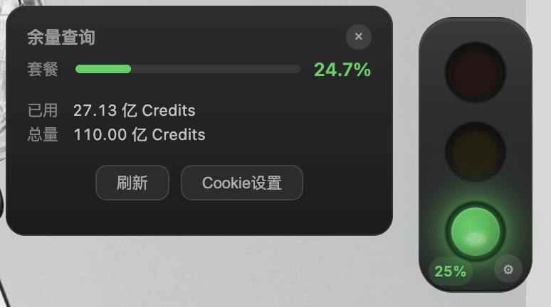

  # 红绿灯 UI 设计

  This is a code bundle for 红绿灯 UI 设计. The original project is available at https://www.figma.com/design/arIlJyZSQE3DeNg08VUGIy/%E7%BA%A2%E7%BB%BF%E7%81%AF-UI-%E8%AE%BE%E8%AE%A1.

  ## Running the code

  Run `npm i` to install the dependencies.

  Run `npm run dev` to start the development server.

  Run `rm -rf dist && NO_PROXY=localhost npx electron .` to run the application.

  Run `npm run dist` to build the application.

  ## 余量查询

  支持查询 Xiaomi Mimo 用量：https://github.com/farion1231/cc-switch/issues/2488#issuecomment-4429924018

  
