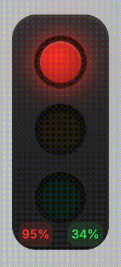
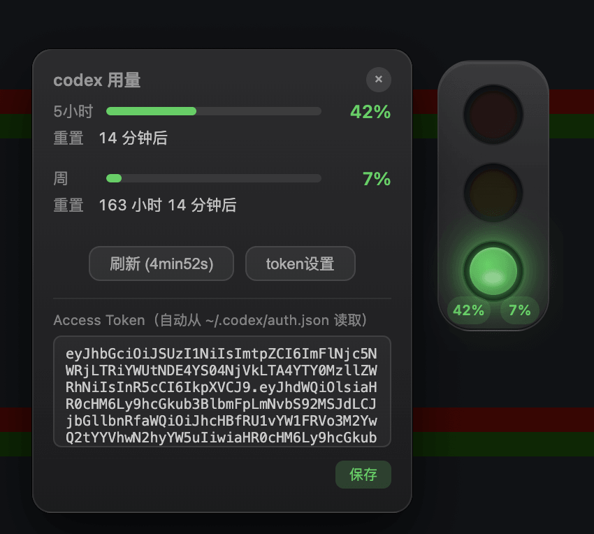
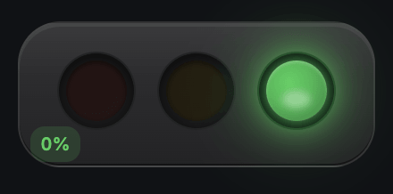

  # Agent 红绿灯

  Agent（Claude Code / Codex）的红绿灯状态提示器，支持用量查询。

  

  ## 功能特性

  - 🔴 红灯：思考中
  - 🟡 黄灯：等待中
  - 🟢 绿灯：已完成
  - 📊 用量查询（MiMo / Codex）
  - 🎨 多种样式（单灯 / 横版三灯 / 竖版三灯）

  ## 支持的工具

  - [x] Claude Code
  - [x] Codex

  ## 运行

  ```bash
  npm i          # 安装依赖
  npm run dev    # 开发模式
  npm start      # 构建并运行
  npm run dist   # 打包
  ```

  ## 用量查询

  - [x] 支持查询 Codex 用量
  - [x] 支持查询 Xiaomi MiMo 用量
  - [x] 支持横版三灯
  - [x] 支持 ClaudeCode hooks
  - [x] 支持 Codex hooks

  

  

  
